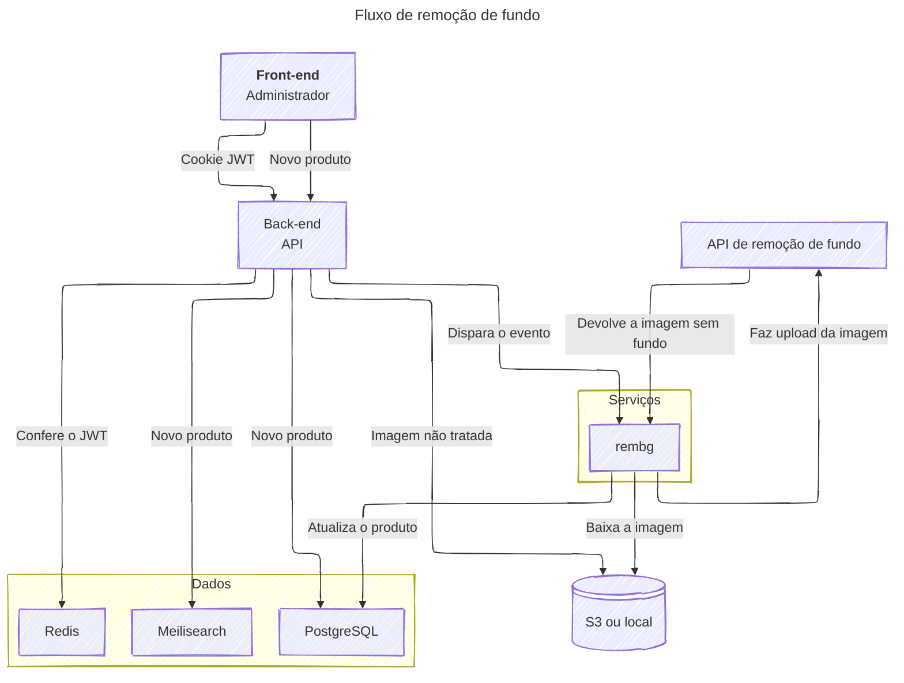

# E-cornance

Sistema de e-commerce com catálogo de produtos, usuários, avaliações, busca e
processamento assíncrono de imagens com remoção automática de fundo.

## Visão geral

O projeto é dividido em duas aplicações principais:

- **Frontend:** aplicação Vue responsável pela interface do e-commerce.
- **Backend:** API Fastify responsável por autenticação, produtos, tipos,
  comentários, upload de imagens e integração com os serviços de infraestrutura.

O processamento de imagens acontece de forma assíncrona. Ao cadastrar um
produto, a API cria um job para remover o fundo da imagem e um worker
envia uma [imagem para um seviço de remoção de fundo](https://github.com/danielgatis/rembg), salva a nova imagem, calcula uma cor de destaque e
atualiza o produto no banco.


### Fluxo de remoção de fundo



## Stack

### Frontend

- Vue 3 com TypeScript
- Vite
- Vue Router com rotas automáticas
- Pinia para estado global
- TanStack Vue Query para cache e requisições
- Axios
- PrimeVue e Tailwind CSS para componentes e estilos
- Orval para geração de código de API
- Biome para formatação e lint

### Backend

- Node.js com TypeScript 
- Fastify 5
- Zod para validação e schemas OpenAPI
- PostgreSQL
- Drizzle ORM
- Redis e BullMQ para filas e jobs
- Meilisearch para indexação e busca de produtos
- JWT e cookies HTTP-only para autenticação
- Multer para upload de arquivos
- AWS SDK para armazenamento S3 compatível
- Sharp e Extract Colors para processamento de imagens
- Swagger e Scalar para documentação da API em desenvolvimento
- Biome para formatação e lint

### Serviços Docker

O arquivo `docker-compose.yml` inicia:

| Serviço     | Imagem                       | Porta  | Finalidade                    |
| ----------- | ---------------------------- | ------ | ----------------------------- |
| PostgreSQL  | `postgres:15-alpine`         | `5432` | Banco de dados principal      |
| Meilisearch | `getmeili/meilisearch:v1.37` | `7700` | Busca e indexação de produtos |
| Redis       | `redis:7-alpine`             | `6379` | Fila e controle dos jobs      |
| rembg       | `danielgatis/rembg`          | `7000` | Remoção de fundo das imagens  |

Os dados persistentes ficam nos volumes `db-data`, `redis-data` e `meili_data`.
O diretório local `data/` é montado no container do `rembg`.

## Pré-requisitos

- Node.js
- npm
- Docker e Docker Compose

## Configuração

renomeie e preencha `backend/.env.exemple` 

>`LOCAL=true` faz o worker salvar as imagens processadas em `backend/src/public`.
Com `LOCAL=false`, as credenciais e configurações AWS/S3 devem ser preenchidas.

## Instalação e execução

Na raiz do projeto, inicie os serviços de infraestrutura:

```bash
docker compose up -d
```

Instale as dependências em cada aplicação em um unico comando:
```bash
npm run install
```

Em um terminal, execute o backend:

```bash
npm run dev:back
```

A API fica disponível em `http://127.0.0.1:1234`.

Em outro terminal, execute o frontend:

```bash
npm run dev:fron
```

O frontend fica disponível no endereço exibido pelo Vite, normalmente
`http://localhost:5173`.

Para processar os jobs de remoção de fundo, mantenha um terceiro terminal com o
worker:

```bash
npm run dev:rmbg
```

Com `DESENVOLVEDOR=true`, a documentação interativa da API fica em
`http://127.0.0.1:1234/api/doc`.

## Banco de dados

O schema está em `backend/src/drizzle/schema.ts` e as migrações ficam em
`backend/src/drizzle/`.

Scripts disponíveis:

```bash
npm run generate  # gera uma nova migração a partir do schema
npm run migrate   # aplica as migrações
npm run seed      # insere dados de exemplo
```

Depois do seed, `npm run postseed` recria o índice de produtos Meilisearch.

*esses três comando são executados no npm run intall*
## Estrutura do projeto

```text
backend/
	src/
		controllers/   Regras de negócio da API
		drizzle/       Schema, relações, migrações e seed
		routes/        Rotas Fastify
		services/rmbg/ Worker e utilitários de processamento de imagens
		utils/         Autenticação, banco, filas, storage e configurações

frontend/
	src/
		api/           Clientes e schemas gerados da API
		components/    Componentes reutilizáveis
		pages/         Páginas e rotas da aplicação
		stores/        Estados globais Pinia
		styles/        Estilos globais

data/              Dados montados no serviço rembg
docker-compose.yml Serviços de infraestrutura
```
